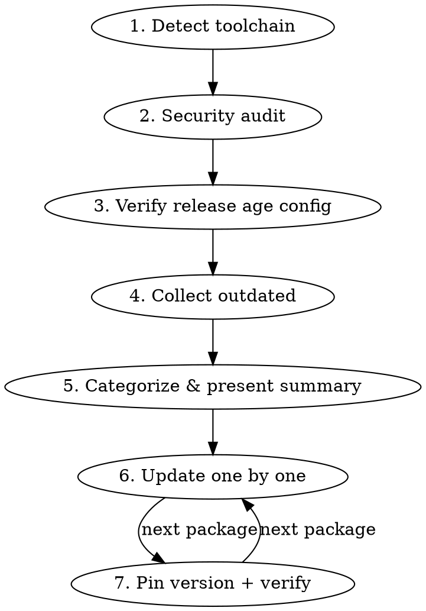

# Package Update (JS/TS)

Safe, methodical package updates with supply chain awareness.

## Overview

Updates packages one at a time, pinning exact versions, with verification after each. Prioritizes security patches, then groups by risk level. Always verifies supply chain safety before touching anything.

Works with bun, pnpm, npm, and yarn. Detect which the project uses before running anything.

## Workflow



## Phase 1: Detect Toolchain

Before running any command, establish two things and reuse them for the rest of the session.

**Package manager** — infer from the lockfile: `bun.lock`/`bun.lockb` → bun, `pnpm-lock.yaml` → pnpm, `package-lock.json` → npm, `yarn.lock` → yarn. If `packageManager` is set in `package.json`, that wins. Never mix managers.

**Verification commands** — read the `scripts` block in `package.json` and identify the type-check and lint commands. Names vary by project (`check-types`, `typecheck`, `tsc`, `check`, `lint`). If nothing obvious exists, fall back to `tsc --noEmit` and ask the user whether a lint step should run too. Record the exact commands — every verify step below uses them.

**Wrappers** — if the project runs its tooling through a wrapper (Docker Compose, a Makefile, a custom CLI), use that wrapper for every command in this skill rather than calling the package manager directly.

## Phase 2: Security Audit

Research recent npm supply chain attacks (last 6 months). Check:
- Whether any project dependencies were directly compromised
- Recent typosquatting campaigns targeting project packages
- Maintainer/ownership transfers on critical packages
- Known CVEs affecting current versions

Use web search for: `npm supply chain attack [year]`, `npm malicious package [year]`, and check the project's most load-bearing dependencies by name.

Also run the registry's own audit (`npm audit`, `pnpm audit`, `yarn npm audit`; bun has no built-in audit — use `npm audit` against the same registry).

Present findings with clear SAFE/AFFECTED/INVESTIGATE status per package.

## Phase 3: Minimum Release Age

**Enforce a minimum 7-day release age on all package updates.** Compromised releases are typically detected and yanked within hours or days, so an age gate skips the poisoned window entirely.

Every major package manager now supports this natively — but the setting name, file, and **unit** all differ. Getting the unit wrong silently disables the gate.

| Manager | File | Setting | Unit | 7-day value |
|---------|------|---------|------|-------------|
| bun | `bunfig.toml` (`[install]`) | `minimumReleaseAge` | seconds | `604800` |
| pnpm (10.16+) | `pnpm-workspace.yaml` | `minimumReleaseAge` | minutes | `10080` |
| yarn (4.10+) | `.yarnrc.yml` | `npmMinimalAgeGate` | minutes | `10080` |
| npm (11.10+) | `.npmrc` | `min-release-age` | days | `7` |

Check whether the project configures its manager's setting. If not, flag it and offer to add it before proceeding. pnpm 11 defaults to `1440` (1 day) — raise it to 7 days rather than assuming the default is enough.

**When recommending target versions:** a version must be older than the configured gate to be installable. Before recommending one, verify its publish date clears the window. If the latest release is too fresh, recommend the most recent version that clears it, and flag the skipped version so the user can revisit.

```bash
npm view <package> time --json
# or: curl -s "https://registry.npmjs.org/<package>" | jq '.time'
```

**Security exception:** if the only version that clears the gate is missing a known security patch present in a newer (too-fresh) version, check whether that newer version contains **only** security fixes. If so, bypass the gate for that one package and document why. A CVE fix justifies the bypass; a routine bugfix does not.

| Manager | Bypass mechanism |
|---------|------------------|
| bun | `minimumReleaseAgeExcludes` in `bunfig.toml`, or `bun install --no-minimum-release-age` |
| pnpm | `minimumReleaseAgeExclude` in `pnpm-workspace.yaml` |
| yarn | `npmPreapprovedPackages` in `.yarnrc.yml` |
| npm | No exclusion mechanism — temporarily lower `min-release-age`, install, then restore it |

## Phase 4: Collect & Categorize

Run the manager's outdated command (`bun outdated`, `pnpm outdated`, `npm outdated`, `yarn upgrade-interactive --dry-run`). In a workspace/monorepo, run it for the root and each workspace.

### Update Priority Order

1. **Security patches** — CVE fixes, known vulnerability patches
2. **Patch updates** — x.y.Z bumps, lowest risk
3. **Minor updates** — x.Y.z bumps within semver range
4. **Ecosystem groups** — packages that must update together
5. **Pinned bumps** — packages already pinned to exact versions that have newer patches
6. **Major/breaking** — new major versions, evaluate individually
7. **Pre-release (0.x)** — minor bumps may be breaking; treat as higher risk

Present a summary table to the user before starting updates: current version, target version, risk notes, and anything skipped by the release-age gate.

### Ecosystem Groups

Some packages share version coupling and must be updated together, or they break on version mismatch. Detect them by two signals: **a shared scope or namespace** (`@tanstack/*`, `@trpc/*`), and **a peer dependency pinning a sibling to a narrow range**. Check `package.json` peerDependencies rather than relying on a fixed list.

Common examples (illustrative, not exhaustive):
- `@tanstack/react-router` + `@tanstack/react-start` + `@tanstack/router-plugin` + related devtools
- `@tanstack/react-query` + `@tanstack/react-query-devtools`
- `@trpc/client` + `@trpc/server` + `@trpc/tanstack-react-query`
- `tailwindcss` + `@tailwindcss/vite` + `@tailwindcss/typography`
- `react` + `react-dom` + `@types/react` + `@types/react-dom`
- `eslint` + its plugins and configs
- `vitest` + `@vitest/*`

## Phase 5: Sequential Updates

For each package (or group):

### 5a. Research Breaking Changes

- Patch bumps: usually safe
- Minor bumps: usually safe, but check the changelog for 0.x packages where minor can break
- Major bumps: research the migration guide, breaking changes, deprecations
- Present findings to the user before proceeding

### 5b. Update & Pin

**Always pin to an exact version** — no `^`, no `~`, no range. The lockfile gives reproducibility, but pinning in `package.json` prevents unintended upgrades when the lockfile is regenerated. Note that npm and pnpm write a `^` range by default, so the exact-save flag is mandatory.

| Manager | Dependency | Dev dependency |
|---------|-----------|----------------|
| bun | `bun add <pkg>@<version>` | `bun add -d <pkg>@<version>` |
| pnpm | `pnpm add --save-exact <pkg>@<version>` | `pnpm add -D --save-exact <pkg>@<version>` |
| npm | `npm install --save-exact <pkg>@<version>` | `npm install -D --save-exact <pkg>@<version>` |
| yarn | `yarn add --exact <pkg>@<version>` | `yarn add -D --exact <pkg>@<version>` |

If the repo uses a workspace catalog (bun/pnpm), the version lives in the catalog, not the consuming `package.json` — edit the catalog entry to the exact target instead.

### 5c. Verify

Run the type-check and lint commands recorded in Phase 1. If they break, investigate and fix before moving to the next package. If the fix is non-trivial, ask the user whether to proceed or roll back.

If the project has a test suite, run it too — a type check does not catch runtime breakage.

### 5d. Report

State what was updated, from/to versions, and whether verification passed.

## Major Version Decisions

For major version bumps, present the user with:
1. What breaking changes exist
2. Migration effort estimate (trivial / moderate / significant)
3. Whether to update now, skip, or defer to a separate branch

Never auto-update a major version without user confirmation.

## Common Mistakes

| Mistake | Fix |
|---------|-----|
| Using `^` or `~` when pinning | Always use exact version: `"react": "19.2.6"` not `"react": "^19.2.6"` |
| Forgetting `--save-exact` on npm/pnpm | They default to a `^` range — the flag is required to actually pin |
| Getting the release-age unit wrong | bun is seconds, pnpm/yarn are minutes, npm is days — a wrong unit silently disables the gate |
| Assuming pnpm's default gate is enough | pnpm 11 defaults to 1 day; this skill requires 7 |
| Updating ecosystem packages individually | Update groups together to avoid version mismatch |
| Skipping verification after update | Always run the project's type-check — catch breakage early |
| Updating everything at once | One package/group at a time — isolate breakage |
| Ignoring catalog entries | Workspaces with catalogs need the catalog version updated too |
| Recommending versions newer than the gate | Verify the target version clears the quarantine — the install will reject it otherwise |
| Mixing package managers | Use the one the lockfile indicates; mixing corrupts resolution |
