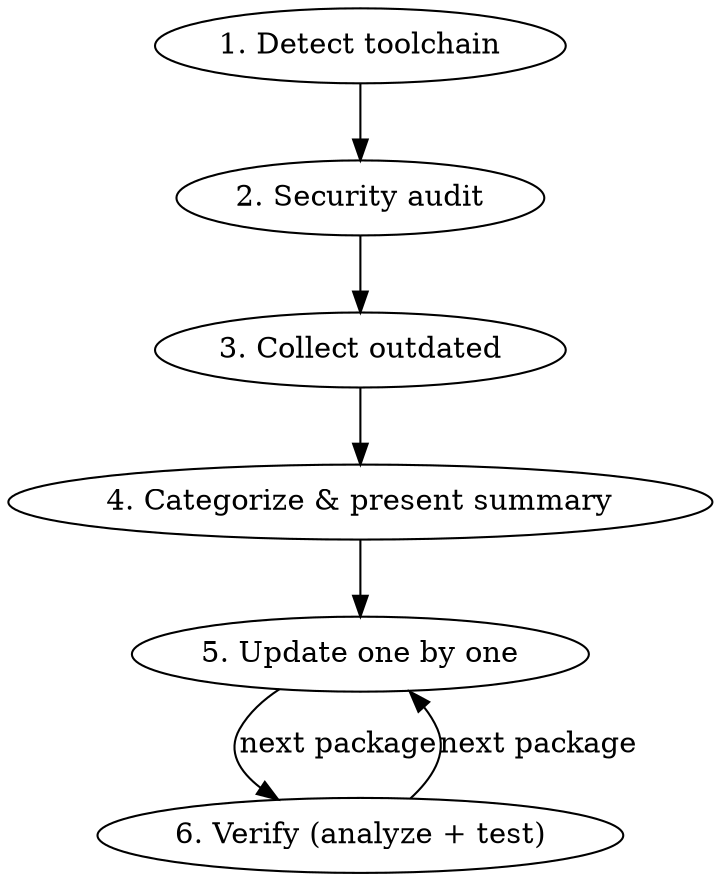

# Package Update (PHP/Composer)

Safe, methodical Composer package updates with supply chain awareness.

## Overview

Updates packages one at a time (or in ecosystem groups), pinning exact versions, with static analysis and tests after each. Prioritizes security patches, then groups by risk level. Always verifies supply chain safety before touching anything.

## Workflow



## Phase 1: Detect Toolchain

Before running any command, establish two things and reuse them for the rest of the session.

**How Composer is invoked.** Many projects don't call `composer` directly — they run it inside a container or through a wrapper (Laravel Sail, Docker Compose, a Makefile target, a project CLI). Check for `docker-compose.yml`, `Makefile`, `Taskfile.yml`, or a bin script in the repo root. If a wrapper exists, use it for **every** Composer command in this skill.

**Verification commands.** Read the `scripts` block in `composer.json` (`composer run-script --list`) and identify the static-analysis and test commands. Common shapes: `composer analyse` / `composer test`, `vendor/bin/phpstan analyse`, `vendor/bin/psalm`, `vendor/bin/pest`, `vendor/bin/phpunit`. If nothing obvious exists, ask the user. Record the exact commands — every verify step below uses them.

Every `composer …` command written below assumes this prefix. Substitute the project's actual invocation.

## Phase 2: Security Audit

Research recent PHP/Composer supply chain incidents (last 6 months). Check:
- Whether any project dependencies have known security advisories
- Recent typosquatting campaigns targeting Packagist packages
- Maintainer/ownership transfers on critical packages
- Known CVEs affecting current versions

Use web search for: `php composer security advisory [year]`, `packagist malicious package [year]`, and check the project's most load-bearing dependencies by name.

Run `composer audit` to check for known vulnerabilities in installed packages.

Present findings with clear SAFE/AFFECTED/INVESTIGATE status per package.

## Phase 3: Collect & Categorize

Run `composer outdated --direct --format=json` to list outdated direct dependencies.

### Release Age Gate

**Enforce a minimum 7-day release age on all package updates.** Any package whose latest release is less than 7 days old is skipped and flagged as "too fresh" in the summary table. This defends against supply chain attacks where a compromised version is live for only hours or days before detection.

Composer has no built-in release-age setting (unlike bun/pnpm/npm/yarn), so the gate must be enforced manually:

- Use the `release-date` field from `composer outdated --format=json` to calculate age
- Compare against today's date
- Security patches with known CVEs are exempt — apply those immediately regardless of age
- Flag skipped packages clearly so the user can revisit them later

### Pin Everything First

Before starting any updates, scan `composer.json` for dependencies using range constraints (`^`, `~`, `*`, `>=`) and pin every one to its currently installed exact version. This makes the full dependency set reproducible and prevents drift on a future `composer update`.

```bash
composer show --direct --format=json     # read installed versions
composer require <package>:<exact-installed-version>
```

**Watch for require/require-dev migration.** Check whether each package sits in `require` or `require-dev` and use the matching flag — Composer will silently move a dev package into `require` (or vice versa) if you use the wrong one.

### Update Priority Order

1. **Security patches** — CVE fixes, packages flagged by `composer audit`
2. **Patch updates** — x.y.Z bumps, lowest risk
3. **Minor updates** — x.Y.z bumps within semver range
4. **Ecosystem groups** — packages that must update together
5. **Major/breaking** — new major versions, evaluate individually
6. **Pre-release (0.x)** — minor bumps may be breaking; treat as higher risk

Present a summary table to the user before starting updates. Include current version, target version, constraint, and risk notes.

### Pre-release (0.x) Packages

Scan `composer.json` for any dependency on a `0.x` version. Semver does not protect you below 1.0 — a `0.Y.z` minor bump can break the API freely. For every 0.x package: always read the changelog before updating, and mark it higher-risk in the summary table.

### Ecosystem Groups

Some packages share version coupling and must be updated together, or they break on version mismatch. Detect them by two signals: **a shared vendor namespace** (`laravel/*`, `filament/*`), and **a hard constraint on a sibling** in the package's own `composer.json` requirements. Check the constraints rather than relying on a fixed list.

Common examples (illustrative, not exhaustive):
- `laravel/framework` + first-party Laravel packages (`laravel/fortify`, `laravel/horizon`, `laravel/sanctum`, `laravel/tinker`, …)
- `filament/filament` + Filament plugins and third-party Filament extensions
- `pestphp/pest` + its plugins (`pestphp/pest-plugin-laravel`, …)
- `phpstan/phpstan` + its extensions (`phpstan/phpstan-*`, `larastan/larastan`, `phpstan/extension-installer`)
- `symfony/*` components used together
- `doctrine/orm` + `doctrine/dbal`

## Phase 4: Sequential Updates

For each package (or group):

### 4a. Research Breaking Changes

- Patch bumps: usually safe
- Minor bumps: check the changelog, especially for 0.x packages where minor can break
- Major bumps: research the migration guide, breaking changes, deprecations
- Consult the package's changelog or upgrade guide directly (repo `CHANGELOG.md`, GitHub releases, or the vendor's upgrade docs)
- Present findings to the user before proceeding

### 4b. Update

**Always use `--no-scripts`.** Post-install scripts run with full shell access and could execute malicious code from a compromised package. Run scripts manually after the update has been reviewed.

```bash
composer require <package>:<exact-version> --no-interaction --no-scripts

# For dev dependencies
composer require --dev <package>:<exact-version> --no-interaction --no-scripts

# After reviewing the update
composer dump-autoload
```

**Always pin exact versions.** Never use `composer update <package>` — always `composer require <package>:<version>` with an exact version (no `^`, no `~`, no ranges). This locks the dependency to a known-good version, makes the update explicit in the diff, and prevents unintended drift on a subsequent `composer update`.

Examples: `composer require laravel/sanctum:4.3.2`, `composer require filament/filament:5.6.3`

### 4c. Verify

Run the static-analysis and test commands recorded in Phase 1.

If analysis or tests fail, investigate and fix before moving to the next package. If the fix is non-trivial, ask the user whether to proceed or roll back with `composer require <package>:<previous-version>`.

### 4d. Report

State what was updated, from/to versions, and whether verification passed.

## Major Version Decisions

For major version bumps, present the user with:
1. What breaking changes exist
2. Migration effort estimate (trivial / moderate / significant)
3. Whether to update now, skip, or defer to a separate branch

Never auto-update a major version without user confirmation.

## Common Mistakes

| Mistake | Fix |
|---------|-----|
| Using `composer update` instead of `composer require` | Always pin with `composer require <pkg>:<exact-version>` — makes the update explicit in `composer.json` |
| Leaving a `^` or `~` constraint | Pin to the exact version: `"laravel/sanctum": "4.3.2"`, not `"^4.3"` |
| Running update without `--no-scripts` | Post-install scripts can execute arbitrary code from a compromised package |
| Updating packages released < 7 days ago | Enforce the release-age gate — compromises are usually detected within days |
| Updating ecosystem packages individually | Update groups together to avoid version mismatch |
| Skipping analysis after update | Always run the project's static analysis — catch type issues early |
| Skipping tests after update | Always run the project's test suite — catch runtime breakage |
| Updating everything at once | One package/group at a time — isolate breakage |
| Treating 0.x minor bumps as safe | Below 1.0, minor bumps can break freely — always check changelogs |
| Using the wrong `--dev` flag when pinning | Composer will silently move the package between `require` and `require-dev` |
| Forgetting `--no-interaction` | Composer commands must run non-interactively |
| Calling `composer` directly when the project wraps it | Use the project's wrapper (Sail, Docker Compose, Makefile) as detected in Phase 1 |
